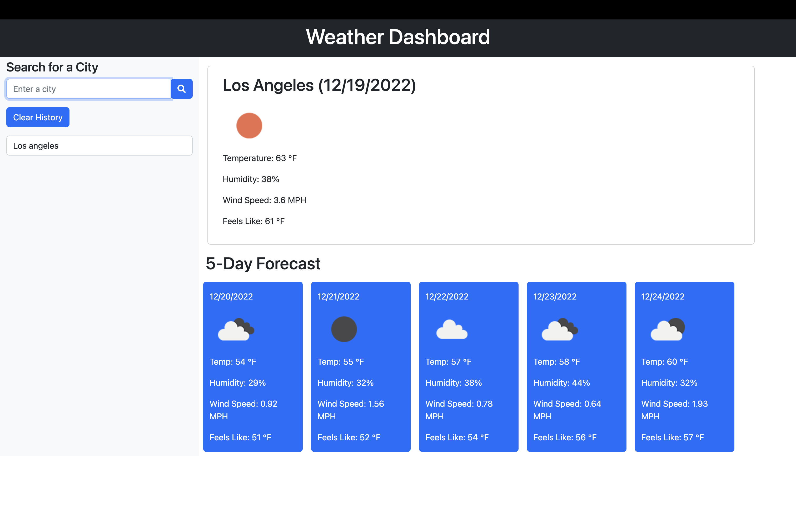
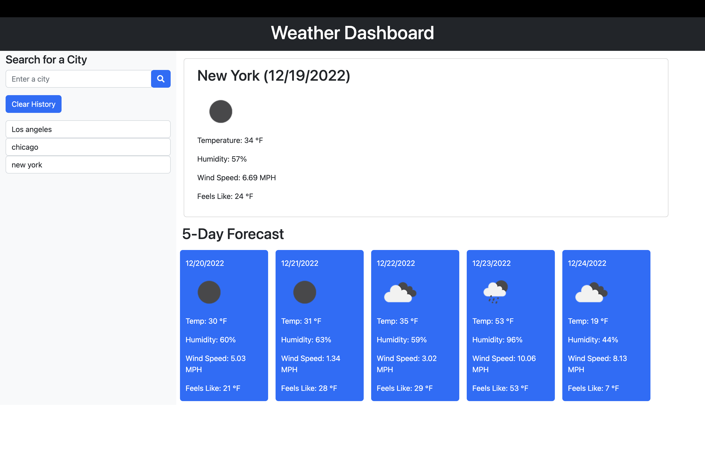

# Weather-Dashboard

## Description
A simple and easy to navigate application that allows users to search the 5-day weather forecast by city name. It includes a variety of information such as temperature, humidity, wind speed, and feels-like temperature. Application can save search history for ease of use.

## Mock up

https://hansbarraza.github.io/weather-dashboard/